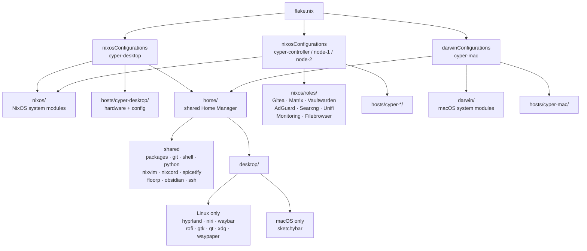

# DerGrumpfs Nix Configuration

A unified Nix flake managing NixOS desktops, a macOS machine via nix-darwin, and a home server cluster — all sharing a common Home Manager configuration.

**Author:** Phil Keier

---

## Machines

| Hostname | Platform | Architecture | Type |
|---|---|---|---|
| cyper-desktop | NixOS | x86_64-linux | Desktop workstation |
| cyper-mac | macOS | x86_64-darwin | nix-darwin + Homebrew |
| cyper-controller | NixOS | x86_64-linux | Home server (runs all services) |
| cyper-node-1 | NixOS | x86_64-linux | Server node |
| cyper-node-2 | NixOS | x86_64-linux | Server node |

---

## Prerequisites

### NixOS

Nix is available out of the box. Enable flakes in your configuration.

### macOS

Install Nix using the [Determinate Systems installer](https://docs.determinate.systems/#products).

> **Note:** Homebrew is managed declaratively via nix-homebrew — if already installed it will auto-migrate, otherwise it is installed automatically.

---

## Quick Start

### Clone

```bash
git clone https://github.com/DerGrumpf/nix ~/.config/nix
cd ~/.config/nix
```

### Customize

Replace placeholders in `home/git.nix`:
- `DerGrumpf` → your Git username
- `phil.keier@hotmail.com` → your Git email

Update `secrets/keys.txt.age` and `.sops.yaml` with your age public key.

### Apply

```bash
# NixOS
sudo nixos-rebuild switch --flake .#cyper-desktop

# macOS
darwin-rebuild switch --flake .#cyper-mac

# Or use the shell alias (auto-detects hostname and platform)
nix-switch
```

### Check (without building)

```bash
nix-check
# expands to: nix flake check --no-build (NixOS)
#          or: nix eval ...darwinConfigurations.(hostname).config... (macOS)
```

---

## Project Structure



---

## Secrets

Secrets are managed with [sops-nix](https://github.com/Mic92/sops-nix) and age encryption.

The age key must exist at `~/.config/sops/age/keys.txt` on every host. To edit secrets:

```bash
sops secrets/secrets.yaml
```

Never edit `.age` files directly.

---

## Shell Aliases (Fish)

| Alias | Expands to |
|---|---|
| `nix-switch` | `sudo nixos-rebuild switch --flake ~/.config/nix#(hostname -s)` |
| `nix-check` | `nix flake check --no-build` (or darwin eval equivalent) |
| `ls` | `eza --icons=always` |
| `la` | `eza -la --icons=always` |
| `tree` | `eza --icons=always -T` |
| `f` | `nvim $(fzf)` |
| `grep` | `rg` |
| `cp` | `rsync -ah --progress` |
| `l` | LLM prompt via Groq → rendered with `glow` |

---

## Useful Links

- [Nix manual](https://nixos.org/manual/nix/stable/)
- [nix-darwin](https://github.com/LnL7/nix-darwin)
- [Home Manager options](https://nix-community.github.io/home-manager/options.html)
- [sops-nix](https://github.com/Mic92/sops-nix)
- [nixvim](https://github.com/nix-community/nixvim)
- [Catppuccin for Nix](https://github.com/catppuccin/nix)
