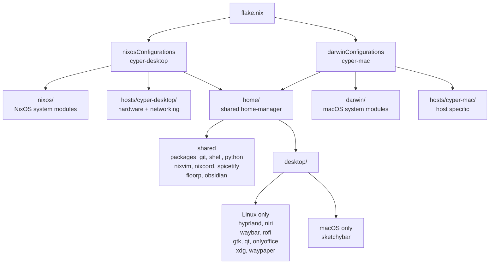

# DerGrumpfs Nix Configuration

A unified Nix configuration for both NixOS and macOS using flakes, nix-darwin, and Home Manager.

## About

A single repository managing both machines declaratively with Nix. Shared home-manager configuration across platforms with platform-specific modules where needed.

**Author:** Phil Keier

## Machines

| Hostname | Platform | Architecture |
|----------|----------|--------------|
| cyper-desktop | NixOS | x86_64-linux |
| cyper-mac | macOS | x86_64-darwin |

## Prerequisites

### NixOS
Nix is available out of the box. Enable flakes in your configuration.

### macOS
Install Nix using the [Determinate Systems installer](https://docs.determinate.systems/#products).

**Note:** Homebrew is managed declaratively via nix-homebrew — if already installed it will auto-migrate, otherwise it is installed automatically.

## Quick Start

### Clone
```bash
git clone https://github.com/DerGrumpf/nix ~/.config/nix
cd ~/.config/nix
```

### Customize

Replace placeholders in `home/git.nix`:
- `DerGrumpf` → your Git username
- `phil.keier@hotmail.com` → your Git email

### Apply
```bash
# NixOS
sudo nixos-rebuild switch --flake .#cyper-desktop

# macOS
darwin-rebuild switch --flake .#cyper-mac

# Or after initial setup on either machine
nix-switch
```

## Project Structure


## Secrets

Secrets are managed with [sops-nix](https://github.com/Mic92/sops-nix) and age encryption. The age key must be present at:

- **Linux:** `~/.config/sops/age/keys.txt`
- **macOS:** `~/.config/sops/age/keys.txt`

## Useful Links

- [Nix manual](https://nixos.org/manual/nix/stable/)
- [nix-darwin docs](https://github.com/LnL7/nix-darwin)
- [Home Manager options](https://nix-community.github.io/home-manager/options.html)
- [sops-nix](https://github.com/Mic92/sops-nix)
- [nixvim](https://github.com/nix-community/nixvim)
